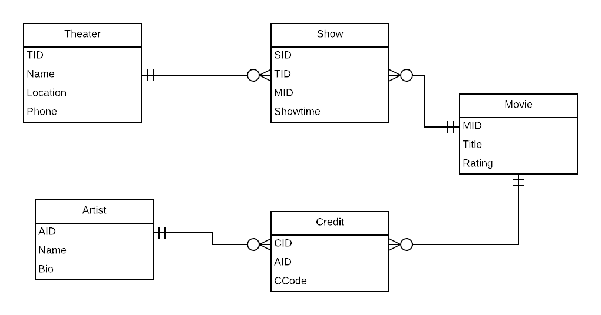

## Normalization analysis
USE `MOVIES_TONIGHT`;

### 5. 1NF Conversion
Single flaw is no primary key for 1NF
correcting through adding surrogate key

CREATE TABLE IF NOT EXISTS `DATASHEET` (
  <u>`TName`</u> varchar(255) NOT NULL,
  `Location` varchar(255) NOT NULL,
  `Phone` varchar(12) NOT NULL,
  <u>`MTitle`</u> varchar(60) NOT NULL,
  <u>`ShowTime`</u> time NOT NULL,
  `Rating` varchar(5) NOT NULL,
  <u>`CCode`</u> char(1) NOT NULL,
  <u>`CName`</u> varchar(255) NOT NULL
) ENGINE=InnoDB DEFAULT CHARSET=latin1;

### 6. 2NF Conversion
TName-->Location, Phone
MTitle-->Rating

### 7. 3NF Conversion
THEATERS-->TName,Location,Phone
MOVIES-->MTitle,Rating
CREDITS-->MovieID,MTitle,CCode,CName
SHOWS-->TName,MTitle,ShowTime
ARTISTS-->Name

THEATERS-->TheaterID,TName,Location,Phone
MOVIES-->MovieID,MTitle,Rating
CREDITS-->MovieID,MTitle,CCode,ArtistID
SHOWS-->TheaterID,TName,MovieID,MTitle,ShowTime
ARTISTS-->ArtistID,Name

### 8. BCNF Conversion
THEATERS-->TID, Location, Phone
MOVIES-->MID, MTITLE, Rating
SHOWS-->SID, TID, Showtime, MID
CREDITS-->CID, MID, Cname, Ccode
ARTISTS-->AID, Name

